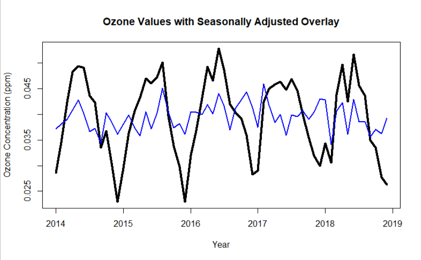

# Ozone Air Quality: Project Overview

We want to explore the average monthly concentration of ozone (ppm) in a local area.

### Part 1: Exploring the Data
* The data recorded daily max 8-hour ozone concentration per observation.
* Looked for missing values and noted which year had the most missing values
* Rolled up data to the monthly level by using the average of the observations present
* Created a time plot of the mean monthly max 8 hour ozone concentration
* Evaluated time plot for potential trends or seasonality captured

### Part 2: ESM Model Building
* Split the data into training (withholding last 17 months), validation (next 12 months), test (last 5 months) data sets
* Created a monthly ESM forecast with the training data set
* Made data visualizations of the following:
  * Actual Ozone values overlaid with the trend/cycle component for the training set
  * Actual Ozone values overlaid with the seasonally adjusted Ozone values for the training set
  * Time Plot of the predicted versus actual for the validation and test data
* Decomposed time series into respective componenets (raw data, trend, seasonality, noise) using STL
* Explored additive ESM vs. multiplicative ESM
* Calculated MAPE and MAE values for evaluating accuracy of forecasts with test data

### Part 3: Testing Stationarity and White Noise
* Checked for stationarity of the average monthly ozone levels including any potential trend and/or random walks
  * used the Augmented Dickey-Fuller tests up to lag 2 tests for the results
* Implemented techniques for getting stationary data such as taking the first difference
* Tested whether the stationary series exhibited white noise using the Ljung-Box test
* Explained implications for futher ARIMA modeling

### Data Visualizations:
 

